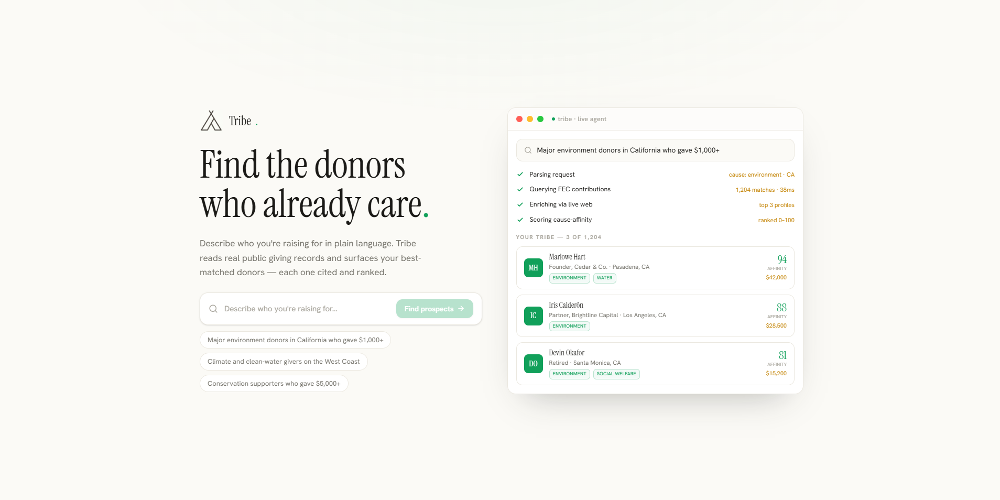
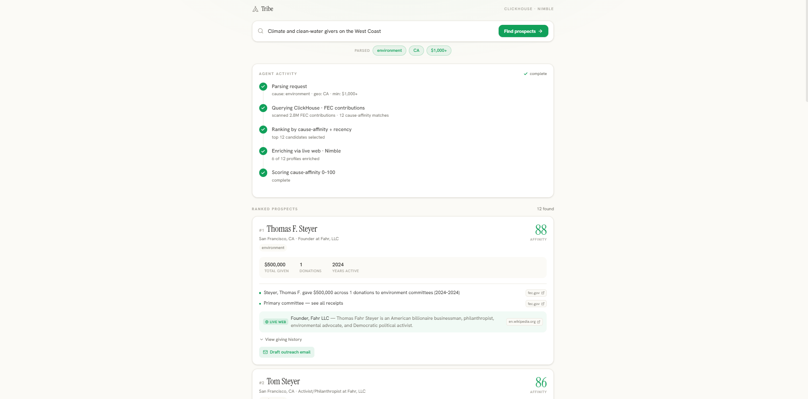

# Tribe

**An autonomous cause-affinity research agent for nonprofit fundraising.**



A fundraiser describes their cause in one plain-English sentence. Tribe autonomously parses it, queries **2.8 million real FEC public-record contributions** in ClickHouse for donors whose *actual giving behavior* matches the cause, enriches the top candidates from the live web with Nimble, scores them by cause-affinity, and returns a ranked, **fully-cited** list of prospects — then drafts a personalized outreach email for each.

The thesis: **who already gives to your cause is a better signal than who's simply wealthy.** Tribe reads revealed preference from real giving records instead of screening for net worth.

> Built in one day for the **Datadog Agentic Engineering Hack** (2026-05-23).

---

## What it does

- **Natural-language search** — "Climate and clean-water givers on the West Coast" → the agent figures out the cause, geography, and giving threshold. No forms, no filters.
- **Real, cited prospects** — every result is a real FEC donor; every claim links back to the public filing on `fec.gov`. No black-box scores.
- **Live web enrichment** — Nimble pulls each top donor's current role and public bio in real time (e.g. Steyer → Wikipedia, Serrurier → Earthjustice board).
- **Drafted outreach** — one click drafts a personalized email grounded in the donor's actual giving history (human reviews before sending).
- **A visible autonomous run** — the whole pipeline streams to the UI step-by-step over Server-Sent Events, so you watch the agent parse → query → rank → enrich → score live.
- **Continuous campaign agent** — define campaigns in plain English; a background agent re-runs and auto-adds new high-affinity donors as fresh data arrives, with zero manual selection.



---

## How it works

```
natural-language ask
   │
   ▼
NL parse  ── Gemini → { cause, geo, min_amount }   (deterministic synonym/adjacency fallback)
   │
   ▼
ClickHouse ── query 2.8M cause-tagged FEC contributions → ranked candidates  (dedup-safe)
   │
   ▼
Nimble ───── live web enrichment of the top candidates (role, bio, public profile)
   │
   ▼
Scoring ──── cause-affinity + recency + capacity → 0–100
   │
   ▼
UI ───────── ranked, cited prospect list (master-detail) + AI-drafted outreach
```

The run is exposed as a `/run` Server-Sent Events stream, so the frontend renders each agent step as it happens.

### The data
- **FEC bulk individual contributions** — ~2.8M real records, 597k donors, all 20 cause categories, 5 states (CA/NY/TX/WA/OR), loaded into ClickHouse.
- **Committee → cause tagging** — committees mapped to ~20 cause tags (keyword + candidate-party inference).
- **ProPublica nonprofits + FEC candidate master** — supplementary org/candidate context.

---

## Tech stack

| Layer | Tech |
|---|---|
| Data warehouse | **ClickHouse** (FEC contributions, committees, causes, candidates) |
| Live web enrichment | **Nimble** Web Search API + Gemini extraction |
| NL parse & email drafting | **Gemini** (`gemini-flash-latest`) |
| Backend | **FastAPI** + Server-Sent Events (Python) |
| Frontend | **Vite + React + TypeScript + Tailwind v4 + framer-motion** |

Sponsor tools: **ClickHouse** (the FEC data warehouse) and **Nimble** (live web enrichment).

---

## Repo layout

```
agent/    Data pipeline: FEC bulk load → ClickHouse, committee→cause tagging,
          Nimble enrichment, ProPublica + candidate sources.
server/   FastAPI /run SSE backend. NL parse → query_clean (dedup-safe donor query)
          → enrichment → scoring → stream. Plus the autonomy agents:
          auto_match.py and campaign_outreach.py.
web/      Vite/React frontend: ask box → live activity stream → master-detail
          prospect list with cited reasons, enrichment, giving history, draft email.
docs/     Strategy, data/query notes, demo script, judge Q&A, and more.
```

---

## Running locally

Requires Python 3.11+, Node 20+, and access to a ClickHouse instance loaded with FEC data.

```bash
# 1. Secrets — copy and fill in real values (never committed; .env is gitignored)
cp .env.example .env      # set CLICKHOUSE_*, NIMBLE_API_KEY, GEMINI_API_KEY

# 2. Backend
cd server && pip install -r requirements.txt
uvicorn main:app --port 8000

# 3. Frontend (separate terminal)
cd web && npm install
npm run dev               # http://localhost:5173
```

**Instant demo (no live API calls):** open **`http://localhost:5173/?demo=1`**. This replays a real, pre-enriched run baked into `web/sample_prospects.json` — instant and reliable, with zero Gemini/Nimble calls.

**The autonomy agent (terminal):**
```bash
python server/campaign_outreach.py demo   # campaigns → auto-match → find contact → draft email
python server/auto_match.py demo          # continuous campaign auto-matching
```

---

## Limitations & what's next

Honest about where it stands after one day:

- **Ranking is capacity-first.** Results currently rank by total giving; the next step is **affinity-first scoring** (cause-specificity → amount-to-that-cause → recency → geography) so the most *relevant* donor wins, not the richest. Design in `docs/DEMO-FEEDBACK.md`.
- **Cause taxonomy is coarse (~20 tags).** Niche asks ("animal shelter") map to the nearest tag (`environment`); adding categories like `animal_welfare` and improving committee-tagging recall would sharpen matches.
- **Contact info.** FEC has no emails/phones; the contact channels shown come from web enrichment, and the drafted emails are research outreach for human review — not automated solicitation.
- **Data scope** is 5 states / one cycle for the demo; the pipeline scales to all states/cycles.

---

## Ethics & legal

Tribe treats FEC data as **public-record research on giving behavior**, with every claim cited back to the public source — not as a solicitation contact list. Note that **11 CFR §104.15** restricts using FEC individual-contributor data to *solicit* donations; outreach is framed as human-reviewed research, and contact channels are sourced independently from the web. See `docs/STRATEGY.md`.

---

## Built by

Enes Yilmaz and Trevor, at the Datadog Agentic Engineering Hack — built across multiple Claude Code agents coordinating through git (see `docs/STATUS.md` for how the team split the work).
